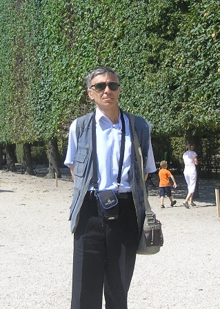

# Материалы по Дискретной математике

**Преподаватель:** Белоусов Алексей Иванович

#### Предисловие
КАТЕГОРИЧЕСКИ РЕККОМЕНДУЮ ПОСЕЩАТЬ ЛЕКЦИИ И СЕМЕНАРЫ, непосещение карается академом / отчислением, так как на экзамене бенефитов в случае не посещения не будет. А дискретную математику у вас заботать так чтоб ответить на любой его вопрос не получится.

Но если вы прилежный студент или тот самый безумец данный репозиторий для вас.

### Что есть?

#### [Лекции 2024-2024 года.](./lectures-2024/). Порядок просмотра:
1. [Теория множеств](./lectures-2024/Множества,%20отношения%20и%20алгебры/);
2. [Графы](./lectures-2024/Графы/);
3. [Языки и автоматы](<lectures-2024/Языки и автоматы>);
4. [Комбинаторика](lectures-2024/Комбинаторика).

#### [Семинары 2024-2025 года.](./seminars-2024/)
Семинары раз в две недели. В конце каждого модуля экзамен.
